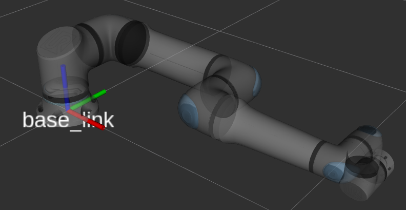
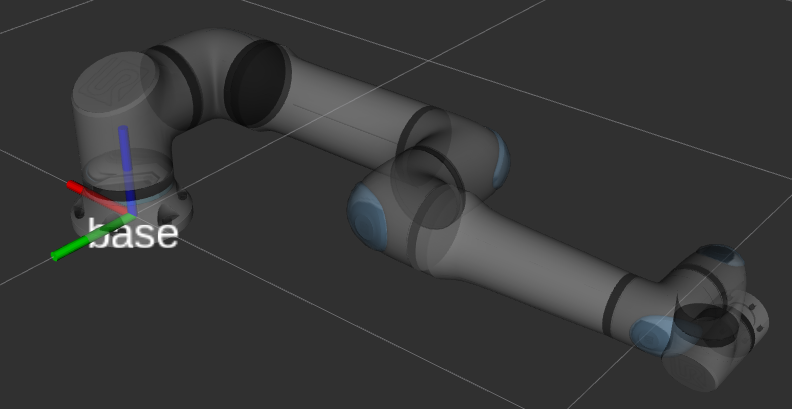

Robot Frames
============

The URDF follows `REP-103 <https://ros.org/reps/rep-0103.html>`_ with respect to the frame
orientations. Specifically, the Z-axis points up, the Y-axis points left, and the X-axis points
forward, where "forward" for the ``base_link`` is defined as the direction of the arm pointing to
for an all-zero joint configuration.

   The robot with an all-zeros joint configuration showing its base_link frame

Furthermore, it follows the `REP proposal 199 <https://gavanderhoorn.github.io/rep/rep-0199.html>`_
with respect to the frame ``base`` and ``tool0``.

Specifically, that means that the frame ``base`` is in the same location and orientation as seen by
the robot controller. In relation to the ``base_link`` frame, it is rotated by 180 degrees around
the Z-axis. In order to maintain the kinematic chain from ``base_link`` to ``tool0``, the ``base``
frame is a sibling of ``base_link``.

   The robot with an all-zeros joint configuration showing its base frame

This leads to the following kinematic chain:

.. code:: text

   base_link
   ├ base
   └ shoulder_link
     └ upper_arm_link
       └ forearm_link
         └ wrist_1_link
           └ wrist_2_link
             └ wrist_3_link
               └ flange
               └ tool0

The frame ``tool0`` is the tool frame as calculated using forward kinematics. If the robot has an
all-zero tool configured, that is equivalent to the ``tool0`` frame in the URDF.

.. note::

   When making TF lookups in the ROS system and comparing that to what the teach pendant shows,
   please consider that the robot uses the ``base`` frame as reference, not ``base_link``. Also,
   make sure that the teach pendant's view is set to "Base" and that any configured tool will have
   an effect on the values.
